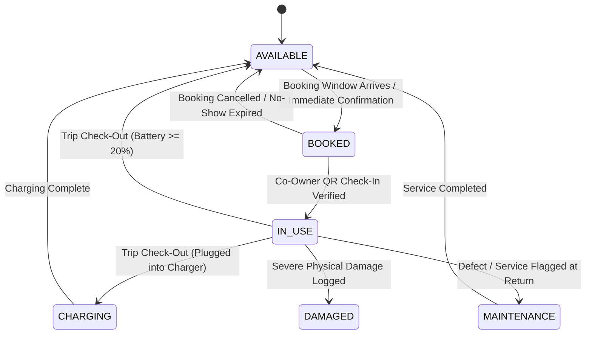

# EVShare 3D — PHASE 05 DOMAIN AUDIT REPORT

**Module**: Vehicle Reservation, Fair Usage Engine & Fleet Usage Operations
**Phase**: `PHASE 05 — BOOKING, FAIR USAGE & VEHICLE OPERATION`
**Checkpoint**: `05-A — BOOKING DOMAIN AUDIT`
**Date**: September 2026
**Status**: **AUDIT COMPLETE / READY FOR IMPLEMENTATION**
**Auditor**: Antigravity Agent

---

## 1. Executive Summary & Objective

The primary objective of **Phase 05** is to engineer the end-to-end vehicle usage lifecycle for the EVShare 3D platform. This encompasses conflict-free spatial reservation scheduling, an equity-weighted fair usage allocation algorithm, a tamper-evident cryptographic QR check-in protocol, usage session telemetry tracking (odometer and battery SoC), and bidirectional synchronization with the authoritative `VehicleStateMachine`.

This domain audit establishes the baseline architectural, domain relational, and business rule analysis for **Phase 05**. It inspects existing foundation models created in Phases 02–04, evaluates constraints, identifies gaps, formalizes mathematical invariants, and defines the roadmap for subsequent Phase 05 implementation checkpoints.

Zero implementation code has been written during this checkpoint.

---

## 2. Target Domain Entity Inspection

### 2.1. `Booking` (`bookings` table)

* **JPA Entity**: [`com.example.evshare.entity.Booking`](file:///e:/EVShare3D/backend/src/main/java/com/example/evshare/entity/Booking.java)
* **Database Table**: `bookings` (MySQL InnoDB, Flyway migration `V4__init_bookings_sessions_and_services.sql`)
* **Existing Fields**:
  - `id`: `BIGINT AUTO_INCREMENT PRIMARY KEY`
  - `vehicle_id`: `BIGINT NOT NULL`, foreign key referencing `vehicles(id)` (`ON DELETE RESTRICT`)
  - `user_id`: `BIGINT NOT NULL`, foreign key referencing `users(id)` (`ON DELETE RESTRICT`)
  - `start_time`: `TIMESTAMP NOT NULL` (represented as `java.time.Instant`)
  - `end_time`: `TIMESTAMP NOT NULL` (represented as `java.time.Instant`)
  - `status`: `VARCHAR(30) NOT NULL DEFAULT 'CONFIRMED'` (mapped to `BookingStatus` enum)
  - `estimated_cost`: `DECIMAL(15, 2) NOT NULL DEFAULT 0.00` (VND currency)
  - `created_at`: `TIMESTAMP NOT NULL DEFAULT CURRENT_TIMESTAMP` (`@CreatedDate`, updatable = false)
* **Database Indexes**:
  - Composite Index: `idx_vehicle_time (vehicle_id, start_time, end_time)` — Essential for rapid interval overlap lookups.
* **Enumeration States (`BookingStatus`)**:
  - `PENDING`: Initial booking request awaiting approval or validation.
  - `APPROVED`: Booking approved by system or group consensus.
  - `CONFIRMED`: Booking locked and scheduled on the vehicle calendar (default state).
  - `IN_USE`: Co-owner has checked in; usage trip is actively in progress.
  - `COMPLETED`: Co-owner has checked out; trip finalized and telemetry recorded.
  - `CANCELLED`: Booking cancelled by co-owner or admin prior to trip commencement.
  - `REJECTED`: Booking rejected due to conflicts, quota limits, or administrative action.
  - `NO_SHOW`: Co-owner failed to check in within the 30-minute grace period.

### 2.2. `UsageSession` (`usage_sessions` table)

* **JPA Entity**: [`com.example.evshare.entity.UsageSession`](file:///e:/EVShare3D/backend/src/main/java/com/example/evshare/entity/UsageSession.java)
* **Database Table**: `usage_sessions` (Flyway migration `V4__init_bookings_sessions_and_services.sql`)
* **Existing Fields**:
  - `id`: `BIGINT AUTO_INCREMENT PRIMARY KEY`
  - `booking_id`: `BIGINT NOT NULL UNIQUE`, foreign key referencing `bookings(id)` (`ON DELETE RESTRICT`)
  - `start_odometer`: `DECIMAL(10, 2) NOT NULL` (Odometer reading in km at check-in)
  - `end_odometer`: `DECIMAL(10, 2) NULL` (Odometer reading in km at check-out)
  - `start_battery`: `INT NOT NULL CHECK (start_battery BETWEEN 0 AND 100)` (Battery SoC % at check-in)
  - `end_battery`: `INT NULL CHECK (end_battery BETWEEN 0 AND 100)` (Battery SoC % at check-out)
  - `check_in_time`: `TIMESTAMP NOT NULL DEFAULT CURRENT_TIMESTAMP` (`@CreatedDate`)
  - `check_out_time`: `TIMESTAMP NULL` (Actual check-out completion timestamp)
  - `status`: `VARCHAR(30) NOT NULL DEFAULT 'ACTIVE'` (mapped to `UsageSessionStatus` enum)
* **Enumeration States (`UsageSessionStatus`)**:
  - `ACTIVE`: Trip currently in progress.
  - `COMPLETED`: Trip concluded normally with check-out telemetry recorded.
  - `DISPUTED`: Trip concluded with contested damage, excessive late return, or severe battery depletion.
* **Key Invariant**: Strict 1:1 relationship between a confirmed booking and an active usage session.

### 2.3. `Vehicle` (`vehicles` table)

* **JPA Entity**: [`com.example.evshare.entity.Vehicle`](file:///e:/EVShare3D/backend/src/main/java/com/example/evshare/entity/Vehicle.java)
* **Database Table**: `vehicles` (Flyway migration `V2__init_vehicles_and_ownership.sql`)
* **State Machine**: Governed by [`VehicleStateMachine.java`](file:///e:/EVShare3D/backend/src/main/java/com/example/evshare/service/VehicleStateMachine.java)
* **7 Canonical States (`VehicleStatus`)**:
  - `AVAILABLE`: Idle in garage bay; ready for reservation or check-in.
  - `BOOKED`: Reserved for an imminent reservation.
  - `IN_USE`: Physical vehicle actively on the road during a session.
  - `CHARGING`: Plugged into a charging stall.
  - `MAINTENANCE`: In service bay for routine maintenance or repairs.
  - `DAMAGED`: Flawed by physical defect or collision; routing to maintenance.
  - `UNAVAILABLE`: Administratively locked out.

### 2.4. `OwnershipShare` & `OwnershipGroup`

* **Entities**: `OwnershipGroup`, `OwnershipShare`
* **Crucial Co-Ownership Invariant**:
  - Every vehicle is bound 1:1 to an `OwnershipGroup`.
  - A co-owner can **only** reserve a vehicle if they hold an active `OwnershipShare` in that vehicle's syndicate (`@ownershipSecurity.isGroupMember(vehicle.ownershipGroup.id, principal.id)`).
  - Equity percentages sum to **exactly 100.00%** (`BR-OWN-01`), establishing the baseline quota for fair usage.

### 2.5. `User`

* **Entity**: `User`
* **Pre-conditions for Booking**:
  - Account must be active (`is_active = true`).
  - Driver license must be uploaded and verified (`driver_licenses.is_verified = true`) per `docs/REQUIREMENTS.md`.

---

## 3. Time Fields & Conflict Prevention Requirements

### 3.1. Time Representation & Granularity

* All date-time values are represented in UTC using `java.time.Instant` in Java and `TIMESTAMP` in MySQL.
* In accordance with **`BR-BKG-01`**:
  - Minimum booking duration: **30 minutes**.
  - Maximum continuous booking duration: **72 hours** (without emergency administrative override).
  - Maximum advance booking window: **30 days** into the future.

### 3.2. Turnaround Buffer Period

* **Mandatory 30-Minute Turnaround Buffer**:
  To account for cleaning, bay relocation, parking alignment, and initial charging, every booking extends an implicit **30-minute buffer window** after its scheduled `end_time`:
  $$\text{EffectiveInterval} = [\text{start\_time}, \text{end\_time} + 30\text{ minutes})$$

### 3.3. Mathematical Overlap Conflict Condition

Two bookings $A$ and $B$ for the same vehicle conflict if and only if:
$$\text{EffectiveInterval}_A \cap \text{EffectiveInterval}_B \neq \emptyset$$

Expressed mathematically for scheduling validation:
$$\text{start}_A < (\text{end}_B + 30\text{m}) \quad \land \quad \text{end}_A > (\text{start}_B - 30\text{m})$$

Any booking in status `CANCELLED` or `REJECTED` is excluded from conflict queries:
$$\text{status} \notin (\text{'CANCELLED'}, \text{'REJECTED'})$$

### 3.4. Concurrency & Race Condition Elimination

* To eliminate race conditions where two co-owners attempt to reserve the same time slot simultaneously:
  1. Booking creation must execute within a `@Transactional(isolation = Isolation.READ_COMMITTED)` boundary.
  2. The transaction must acquire a row-level pessimistic write lock on the target vehicle (`SELECT ... FOR UPDATE` via `VehicleRepository.findByIdForUpdate(vehicleId)`).
  3. While holding the lock, the system runs the conflict query incorporating the 30-minute turnaround buffer.
  4. If any conflicting booking exists, the transaction aborts and throws `BookingConflictException` (HTTP 409 Conflict).

---

## 4. Ownership & Fair Usage Engine Dependencies

### 4.1. Fair Usage Engine Architecture (`FairUsageService`)

In accordance with **`BR-FAIR-01`**, **`BR-FAIR-02`**, and **`BR-FAIR-03`**, vehicle resource allocation is governed by an equity-weighted algorithm:

1. **Monthly Equity Quota ($Q_i$)**:
   Co-Owner $i$'s equitable allotment of hours over a monthly evaluation window (720 hours):
   $$Q_i = \left(\frac{\text{percentage}_i}{100.00}\right) \times 720\text{ hours}$$

2. **Weighted Usage Consumption ($W_i$)**:
   Actual hours logged across completed sessions in the window, adjusted by demand time tier:
   $$W_i = \sum_{\text{session}} \left( \text{DurationHours} \times \text{Multiplier} \right)$$
   - **Peak Demand Tier** (Friday 16:00 – Sunday 22:00, Public Holidays): **1.5x Multiplier**
   - **Standard Demand Tier** (Monday–Friday 07:00 – 16:00): **1.0x Multiplier**
   - **Off-Peak Demand Tier** (Daily 22:00 – 07:00): **0.7x Multiplier**

3. **Fairness Ratio ($FR_i$)**:
   The normalized fairness index comparing co-owner $i$'s relative consumption against their equity stake:
   $$FR_i = \frac{W_i / \sum_{k=1}^N W_k}{\text{percentage}_i / 100.00}$$

4. **Imbalance Classification Tiers**:
   - **$0.90 \le FR_i \le 1.10$**: `FAIR` (Equitable balance)
   - **$0.75 \le FR_i < 0.90$** or **$1.10 < FR_i \le 1.25$**: `SLIGHTLY_IMBALANCED`
   - **$0.50 \le FR_i < 0.75$** or **$1.25 < FR_i \le 1.50$**: `IMBALANCED`
   - **$FR_i < 0.50$** or **$FR_i > 1.50$**: `SEVERELY_IMBALANCED`

5. **Dynamic Priority & Penalty Tracking**:
   - Under-users ($FR_i < 1.0$) gain priority access during peak booking slots.
   - Severe over-users ($FR_i > 1.30$) are throttled from booking peak slots when under-users request them.
   - Late cancellations ($< 12$ hours before start) and No-Shows incur penalty marks recorded on the user's fair usage profile.

---

## 5. Operational Check-In, QR Verification & Telemetry

### 5.1. Cryptographic QR Check-In Protocol (`BR-OPS-01`)

* **Token Issuance**:
  - Eligible starting 15 minutes before scheduled `start_time`.
  - Token is a cryptographically signed payload containing: `bookingId`, `userId`, `vehicleId`, `nonce`, and `expiresAt` (5-minute TTL).
* **Token Verification**:
  - Backend verifies HMAC-SHA256 signature, expiration timestamp, and that booking is in `CONFIRMED` status.
  - Verifies that current time satisfies check-in window:
    $$\text{start\_time} - 15\text{m} \le \text{currentTime} \le \text{start\_time} + 30\text{m}$$
  - If $\text{currentTime} > \text{start\_time} + 30\text{m}$ without check-in, booking is marked `NO_SHOW`.
* **Execution**:
  - Co-owner supplies starting odometer and starting battery SoC (0–100%).
  - Creates `UsageSession` in `ACTIVE` status.
  - Transitions `Booking` from `CONFIRMED` $\to$ `IN_USE`.
  - Transitions `Vehicle` from `BOOKED` (or `AVAILABLE`) $\to$ `IN_USE` via `VehicleStateMachine`.

### 5.2. Operational Check-Out & Return Protocol (`BR-OPS-02`)

* **Return Execution**:
  - Co-owner parks vehicle at designated bay code.
  - Submits final odometer and final battery SoC (0–100%).
  - Validates $\text{end\_odometer} \ge \text{start\_odometer}$.
  - Computes mileage and battery delta.
  - Evaluates minimum battery rule ($\ge 20\%$ or connected to charger).
  - Concludes `UsageSession` to `COMPLETED`.
  - Transitions `Booking` from `IN_USE` $\to$ `COMPLETED`.
  - Transitions `Vehicle` from `IN_USE` $\to$ `AVAILABLE` (or `CHARGING` / `MAINTENANCE` if flagged) via `VehicleStateMachine`.

---

## 6. Vehicle State Dependency Flow

The following state transition matrix governs vehicle and booking interaction:

---

## 7. Gap Analysis & Existing Infrastructure Review

| Subsystem / Capability | Current Status | Identified Gap / Required Enhancement for Phase 05 |
|---|:---:|---|
| **`Booking` Entity & Table** | Ready (`V4`) | Schema complete; requires business validation logic, DTOs, and mapper. |
| **`BookingRepository`** | Partial | Existing `findOverlappingBookings` does not account for the mandatory 30-minute buffer and does not lock rows. Need buffer-aware query and `findVehicleBookingsInInterval`. |
| **`VehicleRepository`** | Partial | Has `findByIdForUpdate` for pessimistic locking. Ready for integration. |
| **`UsageSession` Entity & Table** | Ready (`V4`) | Schema complete; requires check-in, check-out, and telemetry update services. |
| **`UsageSessionRepository`** | Partial | Needs query by booking, active sessions by vehicle, and history lookup. |
| **`VehicleStateMachine`** | Complete | Authoritative 7-state FSM exists and passes 51 tests. Needs invocation from `BookingService` and `UsageSessionService`. |
| **`OwnershipSecurity`** | Complete | Group membership checks exist (`isGroupMember`). Needs booking ownership check (`isBookingOwner`). |
| **`FairUsageService`** | Missing | Needs complete implementation: calculation of quotas, peak hour multipliers, fairness ratios, and recommendations. |
| **QR Check-In Engine** | Missing | Needs cryptographically signed token generator (HMAC-SHA256 / JWT) and validator. |
| **Booking State Machine** | Missing | Needs explicit lifecycle transition validator (`PENDING -> CONFIRMED -> IN_USE -> COMPLETED / CANCELLED / NO_SHOW`). |
| **REST Controllers** | Missing | Needs `BookingController` and `UsageSessionController` exposing endpoints specified in `docs/API.md` (Sections 2.6 & 2.7). |

---

## 8. Phase 05 Implementation Roadmap

Following Checkpoint `05-A`, Phase 05 will proceed systematically through the following sub-checkpoints:

1. **`05-B — BOOKING REPOSITORY & CONCURRENCY QUERY`**:
   Implement buffer-aware overlap detection queries with pessimistic locking (`findOverlappingBookingsWithBuffer`).
2. **`05-C — BOOKING SERVICE & CONFLICT DETECTION`**:
   Implement booking creation, availability timeline lookups, duration constraints (30m to 72h), advance booking window, and ACID conflict rejection.
3. **`05-D — BOOKING LIFECYCLE & CANCELLATION`**:
   Implement cancellation rules (free $\ge 12$h, late $< 12$h with penalty mark), and no-show timeout detection.
4. **`05-E — FAIR USAGE ENGINE`**:
   Implement `FairUsageService` calculating equity quota, peak/off-peak weighted hours, fairness ratio $FR_i$, and imbalance tier categorization.
5. **`05-F — USAGE SESSION & TELEMETRY`**:
   Implement `UsageSessionService` handling check-in, check-out, odometer validation, battery delta, and minimum battery surcharge rules.
6. **`05-G — CRYPTOGRAPHIC QR PROTOCOL`**:
   Implement signed 5-minute QR token generation and validation for physical check-in station integration.
7. **`05-H — VEHICLE STATE SYNCHRONIZATION`**:
   Integrate booking and session lifecycles with `VehicleStateMachine` (`AVAILABLE` $\leftrightarrow$ `BOOKED` $\leftrightarrow$ `IN_USE`).
8. **`05-I — REST API LAYER`**:
   Expose `/api/v1/bookings` and `/api/v1/usage-sessions` endpoints according to `docs/API.md` with strict RBAC and RFC 7807 error handling.
9. **`05-J — PHASE 05 TEST SUITE`**:
   Comprehensive automated unit and integration tests covering all conflict, fairness, check-in/out, and security scenarios.
10. **`05-K — PHASE 05 FINAL VERIFICATION`**:
    Final audit, documentation updates, and Quality Gate certification.

---

## 9. Audit Conclusion

The domain audit for **Phase 05: Booking, Fair Usage & Vehicle Operation** is complete. The foundational database schemas (`bookings`, `usage_sessions`, `vehicles`, `ownership_groups`, `ownership_shares`) and security components provide a robust, verified foundation. The requirements, mathematical invariants, buffer rules, and state machine interactions have been fully documented and clarified.

**STATUS**: **AUDIT COMPLETE / READY FOR IMPLEMENTATION**
**STOP**: In accordance with instructions, no implementation code has been created. Awaiting user instruction for Checkpoint `05-B`.
