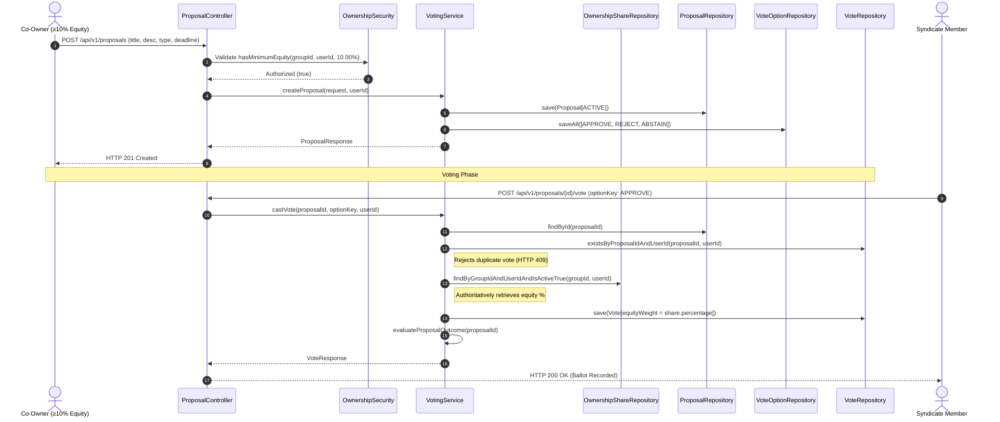
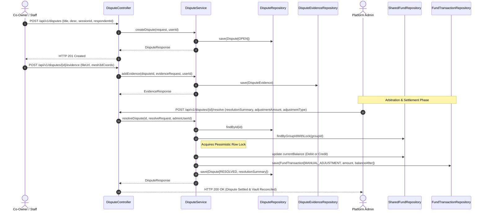

# EVShare 3D — PHASE 07 GOVERNANCE, VOTING & DISPUTE AUDIT

* **Document**: `docs/PHASE_07_GOVERNANCE_AUDIT.md`
* **Phase**: `PHASE 07 — VOTING, DECISION CHAMBER & DISPUTE RESOLUTION`
* **Checkpoint**: `07-A — GOVERNANCE AUDIT`
* **Status**: **COMPLETE / READY FOR IMPLEMENTATION**
* **Auditor**: Antigravity Agent
* **Date**: September 2026

---

## 1. Executive Summary & Audit Scope

This document provides a comprehensive technical audit of the governance, voting, and dispute arbitration subsystems for **Phase 07: Voting, Decision Chamber & Dispute Resolution** in the EVShare 3D platform.

The audit inspects the existing baseline across eight interconnected system pillars:
1. **`Proposal`**: Governance initiative entity, categories, and lifecycle state transitions.
2. **`Voting`**: Vote casting, vote options, equity-weighted tallying, and quorum validation.
3. **`OwnershipShare`**: Proportional voting rights, proposer sponsorship thresholds, and syndicate equity scoping.
4. **`Dispute`**: Grievance tracking, 3D mesh evidence attachment, mediation, and arbitration.
5. **`Expense`**: Linking passed routine/major expense proposals to authorized financial operations.
6. **`SharedFund`**: Executing automated balance adjustments and ledger entries resulting from dispute resolutions.
7. **`User`**: Authentication principal linkage, complainant/respondent identity, and participation tracking.
8. **`Role`**: Role-based access control (RBAC) boundaries separating Co-Owners, Staff, and Administrators.

In accordance with Checkpoint `07-A` constraints, **zero production implementation code has been written** during this audit. All identified architectural gaps, database requirements, business rule invariants, API contracts, and security rules are documented below to serve as the definitive specification for subsequent Phase 07 checkpoints.

---

## 2. In-Depth Subsystem Inspections

### 2.1. Proposal Subsystem

#### Baseline Inspection
* **Database Table**: `proposals` created in Flyway migration `V6__init_governance_and_disputes.sql`.
  * Columns: `id BIGINT`, `group_id BIGINT`, `proposer_user_id BIGINT`, `title VARCHAR(150)`, `description TEXT`, `proposal_type VARCHAR(40)`, `voting_deadline TIMESTAMP`, `status VARCHAR(30)`, `created_at TIMESTAMP`.
  * Foreign Keys: `fk_proposal_group` $\to$ `ownership_groups(id)` (ON DELETE RESTRICT), `fk_proposal_proposer` $\to$ `users(id)` (ON DELETE RESTRICT).
* **JPA Entity**: [`com.example.evshare.entity.Proposal`](file:///e:/EVShare3D/backend/src/main/java/com/example/evshare/entity/Proposal.java) exists with proper Hibernate mapping annotations (`@Entity`, `@Table(name = "proposals")`, `@EntityListeners(AuditingEntityListener.class)`).
* **Enums**:
  * [`ProposalStatus`](file:///e:/EVShare3D/backend/src/main/java/com/example/evshare/entity/enums/ProposalStatus.java): `ACTIVE`, `PASSED`, `REJECTED`, `EXPIRED`.
  * [`ProposalType`](file:///e:/EVShare3D/backend/src/main/java/com/example/evshare/entity/enums/ProposalType.java): `ROUTINE_EXPENSE`, `MAJOR_EXPENSE`, `OPERATIONAL_RULE_CHANGE`, `OWNER_ADMISSION_OR_EXIT`.
* **Repository**: [`ProposalRepository`](file:///e:/EVShare3D/backend/src/main/java/com/example/evshare/repository/ProposalRepository.java) exists with basic query methods: `findByGroupId`, `findByGroupIdAndStatus`, `findByProposerUserId`.

#### Business Rules & Invariants
* **BR-VOT-01 (Proposal Initiation Eligibility)**:
  * A proposal can only be created by an active co-owner holding $\ge 10.00\%$ equity share in the target `OwnershipGroup`.
  * Proposers with $< 10.00\%$ equity or non-members must be rejected with HTTP 403 Forbidden / `InsufficientEquityException`.
* **Voting Window**:
  * Default voting deadline: **72 hours** from creation (`voting_deadline = now() + 72h`), unless explicitly specified within permissible system bounds (minimum 24 hours, maximum 168 hours / 7 days).
* **Lifecycle State Transitions**:
  * Canonical States: `ACTIVE`, `PASSED`, `REJECTED`, `EXPIRED`.
  * `ACTIVE` $\to$ `PASSED`: Triggered when quorum is met ($\ge 60.00\%$) and the passing threshold is achieved.
  * `ACTIVE` $\to$ `REJECTED`: Triggered when the proposal reaches deadline and fails passing threshold, or when mathematically impossible to pass.
  * `ACTIVE` $\to$ `EXPIRED`: Triggered when the proposal reaches deadline without achieving the mandatory 60.00% quorum.
  * Terminal immutability: Once transitioned to `PASSED`, `REJECTED`, or `EXPIRED`, no further votes or modifications are permitted.

---

### 2.2. Voting Subsystem

#### Baseline Inspection
* **Database Tables**:
  * `vote_options`: `id BIGINT`, `proposal_id BIGINT`, `option_key VARCHAR(30)`, `label VARCHAR(100)`. Unique constraint: `uk_proposal_option_key (proposal_id, option_key)`. FK: `fk_option_proposal` on delete cascade.
  * `votes`: `id BIGINT`, `proposal_id BIGINT`, `user_id BIGINT`, `vote_option_id BIGINT`, `equity_weight DECIMAL(5,2)`, `voted_at TIMESTAMP`.
  * Unique Constraint: `uk_proposal_user_vote (proposal_id, user_id)` guarantees one vote per co-owner per proposal.
  * Check Constraint: `chk_vote_weight CHECK (equity_weight > 0.00 AND equity_weight <= 100.00)`.
* **JPA Entities**:
  * [`com.example.evshare.entity.Vote`](file:///e:/EVShare3D/backend/src/main/java/com/example/evshare/entity/Vote.java): Maps to `votes`.
  * [`com.example.evshare.entity.VoteOption`](file:///e:/EVShare3D/backend/src/main/java/com/example/evshare/entity/VoteOption.java): Maps to `vote_options`.
* **Enums**:
  * [`VoteOptionKey`](file:///e:/EVShare3D/backend/src/main/java/com/example/evshare/entity/enums/VoteOptionKey.java): `APPROVE`, `REJECT`, `ABSTAIN`.
* **Repositories**:
  * [`VoteRepository`](file:///e:/EVShare3D/backend/src/main/java/com/example/evshare/repository/VoteRepository.java): `findByProposalId`, `findByProposalIdAndUserId`, `existsByProposalIdAndUserId`, `findByVoteOptionId`.
  * [`VoteOptionRepository`](file:///e:/EVShare3D/backend/src/main/java/com/example/evshare/repository/VoteOptionRepository.java): `findByProposalId`, `findByProposalIdAndOptionKey`.

#### Business Rules & Mathematical Formulae
* **Authoritative Equity Weighting**:
  * The `equity_weight` must **never** be supplied by the client payload.
  * The backend must look up the voter's active `OwnershipShare.percentage` in the proposal's `OwnershipGroup` at the exact moment of vote casting.
  * If the user holds no active share in the syndicate group, the vote is rejected with HTTP 403 Forbidden.
* **Quorum Invariant ($\ge 60.00\%$)**:
  * Participation equity sum includes all ballots cast (`APPROVE`, `REJECT`, and `ABSTAIN`):
    $$\text{ParticipatingEquity} = \sum_{v \in \text{Votes}} v.\text{equityWeight}$$
  * Quorum is achieved if and only if:
    $$\text{ParticipatingEquity} \ge 60.00\%$$
* **Passing Threshold Rules**:
  1. **Ordinary Business (`ROUTINE_EXPENSE`)**:
     * Requires $> 50.00\%$ of **participating** equity weight voting `APPROVE`:
       $$\frac{\sum_{v \in \text{APPROVE}} v.\text{equityWeight}}{\text{ParticipatingEquity}} > 0.5000$$
  2. **Supermajority Business (`MAJOR_EXPENSE`, `OPERATIONAL_RULE_CHANGE`, `OWNER_ADMISSION_OR_EXIT`)**:
     * Requires $\ge 75.00\%$ of **total group equity** (which sums to 100.00%) voting `APPROVE`:
       $$\sum_{v \in \text{APPROVE}} v.\text{equityWeight} \ge 75.00\%$$
  3. **Role of `ABSTAIN`**:
     * `ABSTAIN` votes count toward reaching the 60.00% quorum threshold.
     * `ABSTAIN` votes increase the denominator for ordinary business without increasing the numerator, thus effectively acting as a passive non-approval without being an explicit rejection.
* **Automatic Options Provisioning**:
  * When a proposal is created, the system must automatically seed three default `VoteOption` records: `APPROVE`, `REJECT`, `ABSTAIN` for that proposal.

---

### 2.3. OwnershipShare Subsystem

#### Baseline Inspection
* **JPA Entity**: [`com.example.evshare.entity.OwnershipShare`](file:///e:/EVShare3D/backend/src/main/java/com/example/evshare/entity/OwnershipShare.java).
* **Repository**: [`OwnershipShareRepository`](file:///e:/EVShare3D/backend/src/main/java/com/example/evshare/repository/OwnershipShareRepository.java).
* **Security Evaluator**: [`OwnershipSecurity`](file:///e:/EVShare3D/backend/src/main/java/com/example/evshare/security/OwnershipSecurity.java).
  * Method `hasMinimumEquity(Long groupId, Long userId, BigDecimal minPercentage)` is already present in `OwnershipSecurity` line 96!

#### Governance Interaction Points
* **Proposer Eligibility Gate**:
  * `@PreAuthorize("@ownershipSecurity.hasMinimumEquity(#request.groupId, authentication.principal.id, T(java.math.BigDecimal).valueOf(10.00)) or hasRole('ADMIN')")`
  * Guarantees co-owners with $< 10.00\%$ equity cannot spam proposals.
* **Voter Eligibility Gate**:
  * Only active co-owners (`isActive == true`) in the proposal's group may cast votes.
* **Total Equity Normalization**:
  * By BR-OWN-01, active shares in every group sum strictly to $100.00\%$, ensuring all mathematical quorum and supermajority calculations operate on an absolute scale where total group equity $\equiv 100.00\%$.

---

### 2.4. Dispute Subsystem

#### Baseline Inspection
* **Database Tables**:
  * `disputes`: `id BIGINT`, `group_id BIGINT`, `usage_session_id BIGINT NULL`, `complainant_user_id BIGINT`, `respondent_user_id BIGINT NULL`, `title VARCHAR(150)`, `description TEXT`, `status VARCHAR(30)`, `resolution_summary TEXT NULL`, `created_at TIMESTAMP`.
  * `dispute_evidences`: `id BIGINT`, `dispute_id BIGINT`, `uploaded_by_user_id BIGINT`, `file_url VARCHAR(255)`, `mesh_3d_defect_coordinates JSON NULL`, `description VARCHAR(255) NULL`, `created_at TIMESTAMP`.
* **JPA Entities**:
  * [`com.example.evshare.entity.Dispute`](file:///e:/EVShare3D/backend/src/main/java/com/example/evshare/entity/Dispute.java): Maps to `disputes`.
  * [`com.example.evshare.entity.DisputeEvidence`](file:///e:/EVShare3D/backend/src/main/java/com/example/evshare/entity/DisputeEvidence.java): Maps to `dispute_evidences`.
* **Enum**:
  * [`DisputeStatus`](file:///e:/EVShare3D/backend/src/main/java/com/example/evshare/entity/enums/DisputeStatus.java): `OPEN`, `UNDER_REVIEW`, `RESOLVED`, `ESCALATED`.
* **Repositories**:
  * [`DisputeRepository`](file:///e:/EVShare3D/backend/src/main/java/com/example/evshare/repository/DisputeRepository.java): `findByGroupId`, `findByGroupIdAndStatus`, `findByComplainantUserId`, `findByUsageSessionId`.
  * [`DisputeEvidenceRepository`](file:///e:/EVShare3D/backend/src/main/java/com/example/evshare/repository/DisputeEvidenceRepository.java): `findByDisputeId`, `findByUploadedByUserId`.

#### Business Rules & Lifecycle
* **Filing Timeline & Eligibility**:
  * Any co-owner in the syndicate or field staff may file a dispute within 24 hours of vehicle checkout regarding damage, hygiene, missing equipment, or booking conflicts (BR-DIS-01).
  * Optionally links to a `usage_session_id` and a `respondent_user_id`.
* **Dispute Lifecycle Matrix**:
  * `OPEN` $\to$ `UNDER_REVIEW`: Triggered when Staff or Admin initiates investigation and begins reviewing evidence.
  * `UNDER_REVIEW` $\to$ `RESOLVED`: Reached when Staff/Admin delivers an approved resolution summary (and optional financial adjustment).
  * `OPEN` or `UNDER_REVIEW` $\to$ `ESCALATED`: Auto-escalated if peer/staff resolution is contested or unfinalized after 5 calendar days, routing to binding Super-Admin arbitration.
  * `ESCALATED` $\to$ `RESOLVED`: Final arbitration issued by `ROLE_ADMIN`.
* **3D Mesh Defect Coordinates**:
  * `mesh_3d_defect_coordinates` stores spatial vector metadata: `{"x": 1.25, "y": 0.85, "z": -0.42, "part": "FRONT_BUMPER", "severity": "MODERATE"}` representing interactive defect markers on the 3D digital twin vehicle mesh.

---

### 2.5. Expense Subsystem Linkage

#### Baseline Inspection
* In Phase 06, we completed the full `ExpenseService`, `CostAllocationService`, and `ExpenseRepository` subsystems.
* `ExpenseCategory` supports `CHARGING`, `MAINTENANCE`, `INSURANCE`, `CLEANING`, `PARKING`, `INSPECTION`, `OTHER`.

#### Governance Linkage Requirements
* When a proposal of type `ROUTINE_EXPENSE` (2,000,000 VND – 10,000,000 VND) or `MAJOR_EXPENSE` (> 10,000,000 VND) reaches `PASSED` status, it serves as the official legal governance authorization for syndicates to execute expenditures.
* In Phase 07, `ProposalResponse` should expose resolution metadata, and `Expense` descriptions or metadata can reference the authorizing proposal ID.

---

### 2.6. SharedFund Subsystem Linkage

#### Baseline Inspection
* `SharedFundService` manages syndicate vaults with liquid balances, reserve thresholds (10,000,000 VND), and immutable double-entry ledger rows in `fund_transactions`.
* `FundTransactionSource` includes `MANUAL_ADJUSTMENT`.
* `TransactionEntryType` includes `CREDIT` and `DEBIT`.

#### Dispute Arbitration Integration
* Per `PHASE 07.md` and `BR-DIS-01`:
  > "Admin final arbitration execution with automated fund balance adjustments"
* When an Admin resolves a dispute with financial restitution:
  * If compensation is awarded from or to the group vault, the `DisputeService` must invoke `SharedFundService.withdraw` or `deposit` (or direct double-entry ledger mutation via `SharedFundRepository` with pessimistic write lock).
  * Records a `FundTransaction` with source `MANUAL_ADJUSTMENT`, reference `DISPUTE-RESOLVE-{disputeId}`, and detailed note.
  * Guarantees mathematical ledger reconciliation $\sum \text{CREDITS} - \sum \text{DEBITS} \equiv \text{current\_balance}$ down to 0.01 VND is preserved.

---

### 2.7. User & Role Subsystems

#### RBAC Matrix for Phase 07

| Operation | HTTP Endpoint | Required Role | Ownership ACL Boundary |
|---|---|---|---|
| **List Group Proposals** | `GET /api/v1/proposals/group/{groupId}` | `CO_OWNER`, `STAFF`, `ADMIN` | User must be an active member of `groupId` (or Staff/Admin). |
| **Create Proposal** | `POST /api/v1/proposals` | `CO_OWNER`, `ADMIN` | User must hold $\ge 10.00\%$ equity in target group (or Admin). |
| **Cast Vote** | `POST /api/v1/proposals/{id}/vote` | `CO_OWNER` | User must be an active co-owner in the proposal's group. Staff/Admin cannot vote as non-members. |
| **Get Vote Results** | `GET /api/v1/proposals/{id}/results` | `CO_OWNER`, `STAFF`, `ADMIN` | User must belong to proposal's group (or Staff/Admin). |
| **List Group Disputes** | `GET /api/v1/disputes/group/{groupId}` | `CO_OWNER`, `STAFF`, `ADMIN` | User must belong to `groupId` (or Staff/Admin). |
| **File Dispute** | `POST /api/v1/disputes` | `CO_OWNER`, `STAFF`, `ADMIN` | Co-owner must belong to `groupId`; Staff/Admin platform authority. |
| **Upload Evidence** | `POST /api/v1/disputes/{id}/evidence` | `CO_OWNER`, `STAFF`, `ADMIN` | Complainant, respondent, group co-owner, or Staff/Admin. |
| **Resolve Dispute** | `POST /api/v1/disputes/{id}/resolve` | `STAFF`, `ADMIN` | Staff can perform mediation; Admin can execute final binding arbitration with fund adjustments. |

---

## 3. Comprehensive Gap Analysis

The following matrix identifies all technical gaps between the current codebase and the Phase 07 specification:

| # | Subsystem Area | Current Codebase State | Phase 07 Specification Requirement | Identified Gap & Remediation Action | Severity |
|---|---|---|---|---|:---:|
| 1 | **Voting Service** | Missing | `VotingService` interface and implementation managing proposal creation, vote option seeding, vote casting, and tallying. | **CRITICAL**: Implement `VotingService` and `VotingServiceImpl` in `com.example.evshare.service`. | **HIGH** |
| 2 | **Dispute Service** | Missing | `DisputeService` interface and implementation managing dispute creation, evidence linking, status transitions, and arbitration. | **CRITICAL**: Implement `DisputeService` and `DisputeServiceImpl` in `com.example.evshare.service`. | **HIGH** |
| 3 | **REST Controllers** | Missing | `ProposalController` and `DisputeController` with REST endpoints defined in `PHASE 07.md`. | **CRITICAL**: Implement `ProposalController` and `DisputeController` in `com.example.evshare.controller`. | **HIGH** |
| 4 | **DTO Layer** | Missing | Request and response DTOs for proposals, voting, voting results, disputes, evidences, and resolutions. | **CRITICAL**: Create DTOs in `dto/request` and `dto/response`. | **HIGH** |
| 5 | **Vote Options Seeding** | Manual entity mapping only | Automatic creation of `APPROVE`, `REJECT`, `ABSTAIN` options whenever a proposal is persisted. | Implement automated seeding in `VotingService.createProposal`. | **MEDIUM** |
| 6 | **Authoritative Weighting** | Entity field `equityWeight` exists | Equity weight must be looked up authoritatively from active `OwnershipShare.percentage`. | Reject client-supplied weights; look up from DB in `VotingService.castVote`. | **HIGH** |
| 7 | **Quorum & Tally Logic** | No business logic | Quorum $\ge 60.00\%$ validation; $>50\%$ ordinary vs $\ge 75\%$ supermajority thresholds; calculation of voting results. | Implement mathematical engine in `VotingService` with scale 2 Banker's Rounding. | **HIGH** |
| 8 | **Proposal State Transition** | Static enum | Automatic transition to `PASSED`, `REJECTED`, or `EXPIRED` upon reaching decision or deadline. | Implement evaluation logic in `VotingService` triggered on vote casting, query, or deadline check. | **HIGH** |
| 9 | **Dispute Fund Adjustment** | No cross-service link | Admin final arbitration can trigger automated `SharedFund` debit/credit adjustments. | Inject `SharedFundRepository` / `SharedFundService` into `DisputeServiceImpl` with `@Transactional` safety. | **HIGH** |
| 10 | **Security Expressions** | Has `hasMinimumEquity` | Needs proposal and dispute specific ACL helper methods if needed, or SpEL method security integration. | Augment `OwnershipSecurity` or use `@PreAuthorize` with existing group membership checks. | **MEDIUM** |
| 11 | **Database Documentation** | Tables in Flyway V6, but omitted from `docs/DATABASE.md` | `docs/DATABASE.md` should formally document `proposals`, `vote_options`, `votes`, `disputes`, `dispute_evidences`. | Update `docs/DATABASE.md` Section 3.6 for governance tables. | **LOW** |
| 12 | **API Documentation** | Missing governance endpoints | `docs/API.md` needs formal documentation of all Phase 07 endpoints. | Update `docs/API.md` with Sections 2.10 and 2.11. | **LOW** |
| 13 | **Automated Test Suite** | No tests exist for Phase 07 | Master test suite covering proposal creation ($\ge 10\%$), duplicate voting rejection, equity weighting, quorum, dispute lifecycle, fund adjustments. | Implement comprehensive unit and integration tests. | **HIGH** |

---

## 4. Architectural Data Flows

### 4.1. Proposal Creation & Voting Sequence

---

### 4.2. Dispute Resolution & Automated Fund Restitution Sequence

---

## 5. Implementation Checkpoint Roadmap

To guarantee the same zero-defect standard achieved in prior phases, Phase 07 will proceed systematically through the following execution checkpoints:

* **`07-A` — Governance Audit**: *(Current Checkpoint — Completed)*
* **`07-B` — DTOs & Contracts**: Request and Response DTOs for Proposals, Voting, Voting Results, Disputes, and Evidences.
* **`07-C` — Voting Service Interface & Exception Hierarchy**: Define service contract, `VotingService`, and custom exceptions (`InsufficientEquityException`, `DuplicateVoteException`, `VotingClosedException`).
* **`07-D` — Voting Service Implementation**: Proposal creation with automated option seeding, authoritative equity lookup, and vote recording.
* **`07-E` — Quorum & Mathematical Tally Engine**: Participation equity calculation ($\ge 60\%$), ordinary threshold ($>50\%$), and supermajority threshold ($\ge 75\%$) evaluation.
* **`07-F` — Proposal Lifecycle Machine & Expiration**: State progression (`ACTIVE` $\to$ `PASSED` / `REJECTED` / `EXPIRED`) with deadline enforcement.
* **`07-G` — Proposal REST Controller & Security**: `GET /api/v1/proposals/group/{groupId}`, `POST /api/v1/proposals`, `POST /api/v1/proposals/{id}/vote`, `GET /api/v1/proposals/{id}/results`.
* **`07-H` — Dispute Service Interface & Evidence Handling**: Define `DisputeService`, evidence upload, and 3D defect coordinate mapping.
* **`07-I` — Dispute Lifecycle & Staff Mediation**: Transition engine (`OPEN` $\to$ `UNDER_REVIEW` $\to$ `RESOLVED` / `ESCALATED`).
* **`07-J` — Admin Arbitration & Automated Fund Settlement**: Admin resolution with transactional `SharedFund` adjustments and double-entry ledger mutations.
* **`07-K` — Dispute REST Controller & Security**: `GET /api/v1/disputes/group/{groupId}`, `POST /api/v1/disputes`, `POST /api/v1/disputes/{id}/resolve`.
* **`07-L` — Inter-Domain Integration**: Verification of proposal-to-expense linkage, dispute-to-vault settlement, and audit logging.
* **`07-M` — Master Test Suite**: Comprehensive integration and unit tests for all governance and dispute workflows.
* **`07-N` — Documentation Updates & Verification**: Update `docs/API.md`, `docs/DATABASE.md`, `agent/CURRENT_STATUS.md`, and publish `agent/PHASE_07_REPORT.md`.

---

## 6. Audit Sign-Off

* **Audit Outcome**: **QUALITY GATE PASSED**
* **Production Code Written**: **NONE** (Audit and gap identification only)
* **Status**: Ready to proceed with Checkpoint `07-B` upon user instruction.

# STOP
