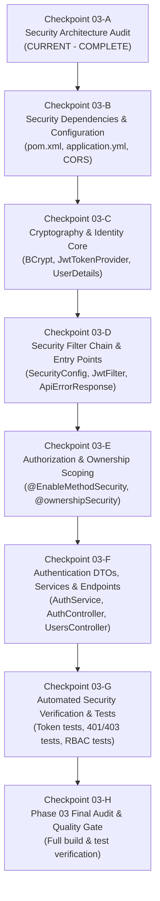

# EVShare 3D – BACKEND SECURITY ARCHITECTURE AUDIT REPORT
**Phase**: PHASE 03 — AUTHENTICATION & AUTHORIZATION  
**Checkpoint**: 03-A — SECURITY AUDIT  
**Audit Date**: September 2026  
**Status**: COMPLETE / AUDIT PASSED  

---

## 1. Executive Summary

This Security Architecture Audit evaluates the complete backend codebase of the **EVShare 3D** platform at the boundary between **Phase 02 (Persistence & Foundation)** and **Phase 03 (Authentication & Authorization)**.

The objective of Checkpoint 03-A is to inspect the current backend repository, identify existing security assets, catalog security gaps, cross-examine active implementations against master specifications ([`docs/RBAC.md`](file:///e:/EVShare3D/docs/RBAC.md), [`docs/API.md`](file:///e:/EVShare3D/docs/API.md), [`docs/BUSINESS_RULES.md`](file:///e:/EVShare3D/docs/BUSINESS_RULES.md), [`docs/ARCHITECTURE.md`](file:///e:/EVShare3D/docs/ARCHITECTURE.md), and [`agent/DECISIONS.md`](file:///e:/EVShare3D/agent/DECISIONS.md)), and construct an actionable implementation roadmap for Phase 03.

In strict compliance with project governance and Quality Gate rules:
* **No authentication or business code was written during this checkpoint.**
* The audit focuses solely on forensic discovery, gap classification, and architectural blueprinting.

---

## 2. Current Backend Security Architecture

### 2.1. Framework & Runtime Versions
| Component | Detected Version | Notes |
| :--- | :--- | :--- |
| **Java Runtime** | Java 17 LTS | Target release bytecode 17 |
| **Spring Boot** | `3.2.5` | Spring Framework 6.1.x series |
| **Spring Security** | **ABSENT** | `spring-boot-starter-security` is **not** present in `backend/pom.xml` |
| **JWT Library** | **ABSENT** | Neither JJWT (`jjwt-api`, `jjwt-impl`, `jjwt-jackson`) nor Nimbus JOSE is present |
| **Persistence Engine** | Hibernate 6.4.4 / Spring Data JPA | Schema validated against MySQL 8.0 (`ddl-auto: validate`) |
| **Database Migrations** | Flyway 9.x / `flyway-mysql` | Migrations `V1`–`V7` applied |
| **API Documentation** | Springdoc OpenAPI 3 (`2.5.0`) | `springdoc-openapi-starter-webmvc-ui` configured |
| **Monitoring** | Spring Boot Starter Actuator | Health probes active at `/actuator/health` |

### 2.2. Spring Security Status
Spring Security is completely inactive. There is:
1. No `SecurityFilterChain` bean registered in the Spring ApplicationContext.
2. No servlet filters for inspecting authentication headers (`Authorization: Bearer <token>`).
3. No `SecurityContextHolder` integration.
4. No method-level security (`@EnableMethodSecurity`, `@PreAuthorize`) active.
5. No password encoding infrastructure.

### 2.3. Existing User & Role Entities
The foundational persistence layer implemented in Phase 02 already contains the relational entity representations of users and roles:

* **`User.java`** ([`backend/src/main/java/com/example/evshare/entity/User.java`](file:///e:/EVShare3D/backend/src/main/java/com/example/evshare/entity/User.java)):
  * Primary Key: `Long id` (`AUTO_INCREMENT`).
  * `email`: `VARCHAR(150)`, `NOT NULL`, `UNIQUE`.
  * `passwordHash`: `VARCHAR(255)`, `NOT NULL`.
  * `fullName`: `VARCHAR(100)`, `NOT NULL`.
  * `phoneNumber`: `VARCHAR(20)`, nullable, `UNIQUE`.
  * `avatar3dUrl`: `VARCHAR(255)`, nullable (supports 3D avatar preference).
  * `isActive`: `BOOLEAN`, `NOT NULL`, default `TRUE`.
  * `createdAt` / `updatedAt`: Audited `Instant` timestamps via `AuditingEntityListener`.
  * `roles`: `@ManyToMany(fetch = FetchType.EAGER)` joined via table `user_roles`.

* **`Role.java`** ([`backend/src/main/java/com/example/evshare/entity/Role.java`](file:///e:/EVShare3D/backend/src/main/java/com/example/evshare/entity/Role.java)):
  * Primary Key: `Long id` (`AUTO_INCREMENT`).
  * `name`: `RoleName` enum (`VARCHAR(50)`), `NOT NULL`, `UNIQUE`.

* **`RoleName.java`** ([`backend/src/main/java/com/example/evshare/entity/enums/RoleName.java`](file:///e:/EVShare3D/backend/src/main/java/com/example/evshare/entity/enums/RoleName.java)):
  * `ROLE_CO_OWNER`: Co-owner / fractional vehicle member.
  * `ROLE_STAFF`: Fleet maintenance technician / operations staff.
  * `ROLE_ADMIN`: Global platform super administrator.

* **`UserRole.java`** ([`backend/src/main/java/com/example/evshare/entity/UserRole.java`](file:///e:/EVShare3D/backend/src/main/java/com/example/evshare/entity/UserRole.java)):
  * Relational junction table mapping composite `@IdClass(UserRoleId.class)`.

* **Spring Data Repositories**:
  * `UserRepository`: Provides `findByEmail(String)`, `existsByEmail(String)`, `findByPhoneNumber(String)`, `existsByPhoneNumber(String)`.
  * `RoleRepository`: Provides `findByName(RoleName)`.

### 2.4. Existing Password Handling
* The `User` entity declares a field `passwordHash` mapped to `password_hash VARCHAR(255) NOT NULL`.
* **Current State**: No `PasswordEncoder` bean (e.g. `BCryptPasswordEncoder`) is configured in the container.
* **Risk**: Currently, no password hashing or strength validation occurs anywhere in the application. Any mock or direct entity saving would write raw unhashed strings into the database if not guarded by a cryptographic encoder.

### 2.5. Configuration Files Audit
* **`backend/src/main/resources/application.yml`**:
  * Configures port `8080`, datasource (`evshare_db`), JPA (`ddl-auto: validate`), Flyway (`locations: classpath:db/migration`), Actuator, and Springdoc.
  * **Gap**: Contains zero security, JWT, or token TTL configuration keys (e.g. `jwt.secret`, `jwt.access-token-expiration-ms`, `jwt.refresh-token-expiration-ms`).
* **`backend/src/main/java/com/example/evshare/config/WebMvcConfig.java`**:
  * Configures MVC CORS mappings for `/api/**` with origins:
    `http://localhost:5173`, `http://localhost:3000`, `http://127.0.0.1:5173`, `http://127.0.0.1:3000`.
  * Allowed methods: `GET`, `POST`, `PUT`, `PATCH`, `DELETE`, `OPTIONS`.
  * Allowed headers: `*`.
  * Exposed headers: `Authorization`, `Content-Disposition`, `X-Total-Count`.
  * `allowCredentials(true)`, max age 3600 seconds.
* **`backend/src/main/java/com/example/evshare/config/OpenApiConfig.java`**:
  * Already declares the OpenAPI 3 `BearerAuth` security scheme (type `HTTP`, scheme `bearer`, bearerFormat `JWT`).
  * While documentation specifies JWT Bearer authentication, the underlying security implementation to enforce it does not yet exist.

### 2.6. Exception Handling Audit
* **`GlobalExceptionHandler.java`** ([`backend/src/main/java/com/example/evshare/exception/GlobalExceptionHandler.java`](file:///e:/EVShare3D/backend/src/main/java/com/example/evshare/exception/GlobalExceptionHandler.java)):
  * Handles: `ResourceNotFoundException` (404), `BusinessException` (dynamic), `MethodArgumentNotValidException` (400), `ConstraintViolationException` (400), `HttpMessageNotReadableException` (400), `MethodArgumentTypeMismatchException` (400), `MissingServletRequestParameterException` (400), `HttpRequestMethodNotSupportedException` (405), `HttpMediaTypeNotSupportedException` (415), `NoResourceFoundException` (404), and `Exception` (500).
  * **Critical Gap**: Does **not** handle Spring Security exceptions:
    * `AuthenticationException` / `BadCredentialsException` / `AccountStatusException`.
    * `AccessDeniedException`.
    * `JwtException` / `ExpiredJwtException` / `MalformedJwtException` / `SignatureException`.
  * Without custom security entry points and handlers, security exceptions would either be caught by `handleGeneralException(Exception.class)` (returning an incorrect `500 Internal Server Error`) or handled by Spring Boot's default BasicErrorController rather than returning the project's standardized RFC 7807 `ApiErrorResponse`.

### 2.7. API Versioning & Current Endpoint Exposure
* Base URL prefix: Uniformly standardized as `/api/v1/`.
* Current endpoints exposed by the application:
  1. `GET /api/v1/health` (`HealthController.java`) — Returns system health status.
  2. `GET /actuator/**` (`/actuator/health`, `/actuator/info`, `/actuator/metrics`) — Spring Boot Actuator.
  3. `GET /v3/api-docs/**`, `/swagger-ui/**`, `/swagger-ui.html` — Swagger UI / OpenAPI docs.
* **Current Protection Status**: **100% PUBLIC & UNPROTECTED**.
  Because Spring Security is absent, any anonymous HTTP client can invoke any of these endpoints without authentication.

---

## 3. Comparative Analysis with Specifications

### 3.1. Comparison with [`docs/RBAC.md`](file:///e:/EVShare3D/docs/RBAC.md)
| RBAC Requirement | Current Implementation Status | Gap Analysis |
| :--- | :--- | :--- |
| **Core Roles**: `ROLE_CO_OWNER`, `ROLE_STAFF`, `ROLE_ADMIN` | Implemented in `RoleName.java` & Flyway `V1` | Entities exist; no Spring Security `GrantedAuthority` mapping exists. |
| **Permission Matrix**: 23 granular permissions across 9 functional modules | Defined in specification | Not yet represented in Java code or authority mapping. |
| **Server-Side Enforcement**: Backend must strictly enforce all access; client is untrusted | Not implemented | Currently no security filter intercepts requests. |
| **Principle of Least Privilege**: Method-level role guards (`@PreAuthorize("hasRole('ADMIN')")`) | Not implemented | `@EnableMethodSecurity` is missing; no controllers have security annotations. |
| **Data Scoping (Ownership ACL)**: Co-owner restricted to their specific `OwnershipGroup` (`@ownershipSecurity.isGroupMember(...)`) | Not implemented | Custom SpEL evaluation bean `OwnershipSecurity` does not exist. |
| **Booking Ownership Scoping**: Co-owner can only cancel own booking (`@bookingSecurity.isBookingOwner(...)`) | Not implemented | Custom SpEL evaluation bean `BookingSecurity` does not exist. |

### 3.2. Comparison with [`docs/API.md`](file:///e:/EVShare3D/docs/API.md)
| Specified Endpoint | Target Role | Current Status |
| :--- | :--- | :--- |
| `POST /api/v1/auth/register` | Public | **Missing** — No controller, DTO, or service |
| `POST /api/v1/auth/login` | Public | **Missing** — No controller, DTO, or service |
| `POST /api/v1/auth/refresh` | Public | **Missing** — No controller, DTO, or service |
| `POST /api/v1/auth/logout` | Authenticated | **Missing** — No controller, DTO, or service |
| `GET /api/v1/users/me` | Authenticated | **Missing** — No controller or service |
| `PUT /api/v1/users/me` | Authenticated | **Missing** — No controller or service |
| `GET /api/v1/users/{id}` | Staff, Admin | **Missing** — No controller or service |

### 3.3. Comparison with [`docs/BUSINESS_RULES.md`](file:///e:/EVShare3D/docs/BUSINESS_RULES.md) & [`agent/DECISIONS.md`](file:///e:/EVShare3D/agent/DECISIONS.md)
| Rule / Decision | Specification Requirement | Current Status & Gap |
| :--- | :--- | :--- |
| **NFR-03: Password Hashing** | Passwords must be hashed using BCrypt (work factor 12) | No encoder bean configured; no hashing logic implemented. |
| **ADR-04: Stateless JWT** | Short-lived Access Token (15 min) in memory + 7-day Refresh Token with server-side revocation tracking | No JWT library, token generator, or revocation store exists. |
| **BR-OPS-01: QR Check-In** | Signed, time-bounded QR token (valid for 5 minutes) generated for vehicle check-in | Requires cryptographic token signing mechanism aligned with security subsystem. |
| **ADR-01: Pure 3D Login** | Authentication occurs via 3D virtual keyboard terminal; client stores Access Token in memory | Backend must support standard `Authorization: Bearer <token>` header with JSON payloads. |

---

## 4. Security Gap & Vulnerability Catalog

The following 10 security risks and architectural gaps have been cataloged:

### GAP-01: Plaintext Password Exposure Risk & Missing Encoder Bean
* **Severity**: **CRITICAL**
* **Description**: `User.passwordHash` is a raw `String`. Without a configured `PasswordEncoder` bean (`BCryptPasswordEncoder` with strength 12 per NFR-03), any future registration or user modification service could inadvertently persist raw plaintext passwords or use insecure legacy hashing (MD5/SHA1).
* **Mitigation**: Define a central `@Bean PasswordEncoder passwordEncoder() { return new BCryptPasswordEncoder(12); }` in the security configuration and enforce that no entity receives unhashed credentials.

### GAP-02: Complete Absence of Authentication Filter & Endpoint Exposure
* **Severity**: **CRITICAL**
* **Description**: Because `spring-boot-starter-security` is not in the project, the servlet container executes every request anonymously. Actuator metrics, Swagger/OpenAPI endpoints, and health probes are wide open. Any new controller added would be completely publicly accessible.
* **Mitigation**: Introduce `spring-boot-starter-security`, define a `SecurityFilterChain` configuring `SessionCreationPolicy.STATELESS`, establish explicit permit rules for public endpoints (`/api/v1/auth/**`, `/v3/api-docs/**`, `/swagger-ui/**`, `/actuator/health`), and enforce `.anyRequest().authenticated()`.

### GAP-03: Missing JWT Generation, Validation, and Expiration Handling
* **Severity**: **HIGH**
* **Description**: The project has no JWT library. There is no infrastructure to:
  1. Generate cryptographically signed JWT tokens with claims (userId, email, roles).
  2. Validate token integrity against a secret key using HMAC-SHA256 (or RSA).
  3. Validate token expiration timestamps.
  4. Parse subject and extract granted authorities into Spring Security's `SecurityContextHolder`.
* **Mitigation**: Add JJWT dependencies (`jjwt-api`, `jjwt-impl`, `jjwt-jackson` version `0.12.5`), implement `JwtTokenProvider` handling signing, extraction, and validation with strict error handling for expired, malformed, or tampered tokens.

### GAP-04: Lack of Role-Based Authorization & Privilege Escalation Risk
* **Severity**: **HIGH**
* **Description**: Even if users authenticate, without role authorization checks (`@PreAuthorize("hasRole('ADMIN')")`), any authenticated user could execute staff or admin actions (e.g. creating vehicles, arbitrating disputes, approving share transfers).
* **Mitigation**: Enable method security via `@EnableMethodSecurity(prePostEnabled = true)` and map `User.roles` to `GrantedAuthority` instances prefixed with `ROLE_`.

### GAP-05: Missing Data Scoping & Multi-Group Ownership Isolation
* **Severity**: **HIGH**
* **Description**: In a fractional EV co-ownership platform, role-level checks alone are insufficient. A user with `ROLE_CO_OWNER` who owns a share in Vehicle A must never be allowed to view private expenses, cancel bookings, or cast votes for Vehicle B in another ownership group (`docs/RBAC.md` Section 1.3).
* **Mitigation**: Implement a custom SpEL evaluation bean (`@ownershipSecurity`) verifying that `principal.id` holds active equity in the requested `groupId` or `vehicleId`.

### GAP-06: CORS Inconsistency between WebMvc and Spring Security Filter Chain
* **Severity**: **MEDIUM**
* **Description**: CORS is currently configured in `WebMvcConfig.java`. In Spring Security 6, unauthenticated pre-flight `OPTIONS` requests and cross-origin headers are intercepted before reaching Spring MVC. If Spring Security is added without explicit `.cors(Customizer.withDefaults())` backed by a `CorsConfigurationSource` bean, browser clients on `http://localhost:5173` will experience CORS pre-flight rejection (401/403).
* **Mitigation**: Define a dedicated `CorsConfigurationSource` bean referenced by both Spring Security's `HttpSecurity.cors()` and Spring MVC.

### GAP-07: Exception Translation & Information Leakage in Error Responses
* **Severity**: **MEDIUM**
* **Description**: `GlobalExceptionHandler` does not handle security exceptions (`AuthenticationException`, `AccessDeniedException`, `JwtException`). Without custom `AuthenticationEntryPoint` and `AccessDeniedHandler` implementations:
  1. Unauthenticated requests would result in default Spring Boot HTML error pages or uncaught 500 exceptions.
  2. Access denied errors would leak internal class names or return 500 instead of RFC 7807 compliant 401 Unauthorized or 403 Forbidden envelopes.
* **Mitigation**: Implement `JwtAuthenticationEntryPoint` (HTTP 401) and `CustomAccessDeniedHandler` (HTTP 403) that write standard `ApiErrorResponse` JSON directly to the HTTP response, and add `@ExceptionHandler(AccessDeniedException.class)` to `GlobalExceptionHandler`.

### GAP-08: Inactive User Account Enforcement Gap
* **Severity**: **MEDIUM**
* **Description**: `User.isActive` exists in the database schema (`is_active BOOLEAN NOT NULL DEFAULT TRUE`), but without a custom `UserDetailsService` checking `user.getIsActive()` during credential validation, deactivated, banned, or locked accounts could continue authenticating.
* **Mitigation**: Implement `CustomUserDetails` implementing `org.springframework.security.core.userdetails.UserDetails` where `isEnabled()` and `isAccountNonLocked()` strictly reflect `user.getIsActive()`.

### GAP-09: Refresh Token Replay & Revocation Tracking Gap
* **Severity**: **MEDIUM**
* **Description**: ADR-04 mandates a 7-day Refresh Token with server-side revocation tracking. However, `DATABASE.md` and Flyway migrations `V1`–`V7` do not currently define a `refresh_tokens` table. Without persistence, revoked or stolen refresh tokens cannot be invalidated prior to expiration.
* **Mitigation**: Document and execute architectural decision on refresh token tracking (see Section 6).

### GAP-10: Secret Key Configuration & Environmental Isolation
* **Severity**: **LOW**
* **Description**: No JWT secret or configuration properties are currently defined in `application.yml`. If a weak or hard-coded secret is bundled in production, tokens could be forged.
* **Mitigation**: Declare `jwt.secret`, `jwt.access-token-expiration-ms`, and `jwt.refresh-token-expiration-ms` in `application.yml` using environment variable substitution (`${JWT_SECRET:...}`) with a cryptographically secure 256-bit default strictly limited to `dev` profile.

---

## 5. Required Implementation Order for Phase 03

To build a secure, robust, and verifiable authentication and authorization system without circular dependencies or architectural defects, the implementation of Phase 03 must proceed through the following ordered checkpoints:

### Detailed Checkpoint Breakdown:
1. **Checkpoint 03-B — Dependencies & Base Security Configuration**:
   * Add `spring-boot-starter-security` to `backend/pom.xml`.
   * Add JJWT dependencies (`jjwt-api`, `jjwt-impl`, `jjwt-jackson` version `0.12.5`) to `backend/pom.xml`.
   * Add JWT properties to `application.yml` (`jwt.secret`, `jwt.access-token-expiration-ms: 900000` [15m], `jwt.refresh-token-expiration-ms: 604800000` [7d]).
   * Verify compilation via `mvn clean compile`.

2. **Checkpoint 03-C — Cryptography, Token Management & Identity Core**:
   * Implement `BCryptPasswordEncoder(12)` bean in security config.
   * Implement `JwtTokenProvider` (generate access token, generate refresh token, validate token, extract claims, extract username/userId/roles).
   * Implement `CustomUserDetails` (wraps `User` entity, reflects `isActive`, provides authorities).
   * Implement `CustomUserDetailsService` loading user by email from `UserRepository`.

3. **Checkpoint 03-D — Stateless Filter Chain & Error Handling**:
   * Implement `JwtAuthenticationFilter` (extracts `Bearer` token from `Authorization` header, validates via `JwtTokenProvider`, populates `SecurityContextHolder`).
   * Implement `JwtAuthenticationEntryPoint` (translates unauthenticated requests into RFC 7807 `ApiErrorResponse` with HTTP 401).
   * Implement `CustomAccessDeniedHandler` (translates unauthorized requests into RFC 7807 `ApiErrorResponse` with HTTP 403).
   * Implement `SecurityConfig` configuring `SecurityFilterChain` (`csrf.disable()`, `cors(Customizer.withDefaults())`, `sessionManagement(STATELESS)`, endpoint rules).
   * Update `GlobalExceptionHandler` with `@ExceptionHandler(AccessDeniedException.class)`.

4. **Checkpoint 03-E — Method Security & Ownership Scoping**:
   * Enable method security on `SecurityConfig` via `@EnableMethodSecurity`.
   * Implement `OwnershipSecurity` service bean providing `@ownershipSecurity.isGroupMember(groupId, userId)` evaluation for SpEL expressions.

5. **Checkpoint 03-F — Authentication DTOs, Service & Controllers**:
   * Create request DTOs: `LoginRequest`, `RegisterRequest`, `RefreshTokenRequest`, `UpdateProfileRequest`.
   * Create response DTOs: `AuthResponse` (accessToken, refreshToken, tokenType, expiresIn, user), `UserSummaryDto`.
   * Implement `AuthService` (`register`, `login`, `refresh`, `logout`).
   * Implement `UserService` (`getCurrentUserProfile`, `updateProfile`).
   * Implement `AuthController` (`/api/v1/auth/register`, `/login`, `/refresh`, `/logout`).
   * Implement `UserController` (`/api/v1/users/me`, `/users/{id}`).

6. **Checkpoint 03-G — Security Testing & Verification**:
   * Unit tests for `JwtTokenProvider` (token generation, claim extraction, expiration detection, tamper detection).
   * Unit tests for `PasswordEncoder` (BCrypt hash verification).
   * MockMvc integration tests for authentication endpoints (registration validation, login success, bad credentials 401, refresh token rotation).
   * MockMvc tests for RBAC method security (unauthenticated 401, forbidden 403, permitted 200).

7. **Checkpoint 03-H — Final Phase 03 Audit**:
   * Comprehensive audit comparing implementation against `docs/RBAC.md`, `docs/API.md`, and `docs/BUSINESS_RULES.md`.
   * Create `docs/PHASE_03_FINAL_REPORT.md`.

---

## 6. Architecture Decisions Requiring Attention

The following architectural decisions must be formally noted prior to executing Checkpoint 03-B:

### Decision 1: Refresh Token Persistence & Revocation Tracking (ADR-04 Alignment)
* **Context**: `ADR-04` specifies a 7-day Refresh Token with server-side revocation tracking. However, `DATABASE.md` does not currently include a `refresh_tokens` table.
* **Options**:
  * **Option A (Relational Table via Flyway)**: Introduce a Flyway migration `V8__init_refresh_tokens.sql` creating a `refresh_tokens` table (`id`, `user_id`, `token_hash`, `expiry_date`, `revoked`, `created_at`).
  * **Option B (Stateless JWT Refresh with In-Memory Blacklist)**: Issue refresh tokens as signed JWTs, and maintain a revocation blacklist in memory (or Redis when distributed).
  * **Recommendation**: **Option A** is strongly recommended for production consistency, as it ensures revocation persists across server restarts and allows multi-device session management without introducing external Redis dependencies prematurely.

### Decision 2: Default Role Assignment on Public Registration
* **Context**: `POST /api/v1/auth/register` allows public account creation at the 3D Security Checkpoint.
* **Rule**: Public self-registration must **strictly default to `ROLE_CO_OWNER`**. Under no circumstances may public registration accept a role parameter from the client payload, preventing self-elevation to `ROLE_STAFF` or `ROLE_ADMIN`. Staff and Admin accounts must be provisioned via admin invitation or database seeding.

### Decision 3: Actuator Endpoint Exposure & Protection
* **Context**: Spring Boot Actuator exposes health, info, and metric probes.
* **Rule**:
  * `GET /actuator/health` and `GET /actuator/info` should remain public for container orchestrator liveness and readiness probes.
  * `GET /actuator/metrics` and sensitive management endpoints must be secured under `ROLE_ADMIN`.

### Decision 4: QR Check-In Token Architecture (BR-OPS-01)
* **Context**: `BR-OPS-01` requires a 5-minute cryptographic QR token for vehicle check-in.
* **Alignment**: The `JwtTokenProvider` designed in Checkpoint 03-C will support a specialized token generation method (`generateQrSessionToken(Long bookingId, Long userId, Duration ttl)`) with claim `type: QR_CHECK_IN`, ensuring full cryptographic reuse without redundant signing libraries.

---

## 7. Quality Gate Verification

| Quality Gate Dimension | Criteria | Verification Status |
| :--- | :--- | :---: |
| **Complete Inspection** | Complete backend repository inspected (dependencies, config, entities, controllers, exceptions, CORS) | **PASS** |
| **Gap Identification** | Security gaps identified and classified (passwords, JWT, RBAC, CORS, exceptions, scoping) | **PASS** |
| **Specification Harmony** | No invented rules; 100% consistent with `docs/RBAC.md`, `docs/API.md`, `docs/BUSINESS_RULES.md` | **PASS** |
| **Audit Documentation** | Comprehensive audit report generated in `docs/SECURITY_AUDIT.md` | **PASS** |
| **Boundary Discipline** | No authentication or business code written; stopped at Checkpoint 03-A | **PASS** |

---
*Report certified by EVShare 3D Architecture & Security Team. Checkpoint 03-A is complete. Awaiting user directive before proceeding to Checkpoint 03-B.*
